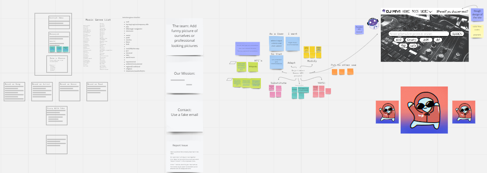

# Daja-limavi
## *Table of Contents*
- [Description](#description)
- [How to use](#how-to-use)
- [Features](#features)
- [Collaborators](#collaborators)
- [Built With](#built-with)
- [Future Updates](#future-updates)
- [License](#license)
- [Deployed application](https://matthewmontiel.github.io/daja-limavi/)

## Progress (or the process) with screenshots

## *Description*

As a user I want to get music recommendations

When I input criteria and click partytime

Then I am presented with recommendations

## *How to use*

To get results from

To add a screenshot, create an `assets/images` folder in your repository and upload your screenshot to it. Then, using the relative file path, add it to your README using the following syntax:

## *Features*
click giphy words

## *Collaborators*

***M Vincent Richards*** https://github.com/vrich88 
***Matt Montiel*** https://github.com/MatthewMontiel 
***Danny Cohen*** https://github.com/dctristero 
***Jacqueline Martinez*** https://github.com/JackieAmartinez 
***Lindsey Isaac*** https://github.com/LindseyIsaac

## *Built With*
This section should list any major frameworks/libraries used to bootstrap your project. Leave any add-ons/plugins for the acknowledgements section. 

## *Future Updates*
- As our class goes on and we learn more we want to come back and implement more of what we learn to improve this sites functionality. 
- 
-
-
- In the end we would like for this project to become an application capable of playing music and not just sourcing them.

## *License*
MIT License

Copyright (c) 2023 MatthewMontiel

[def]: #description