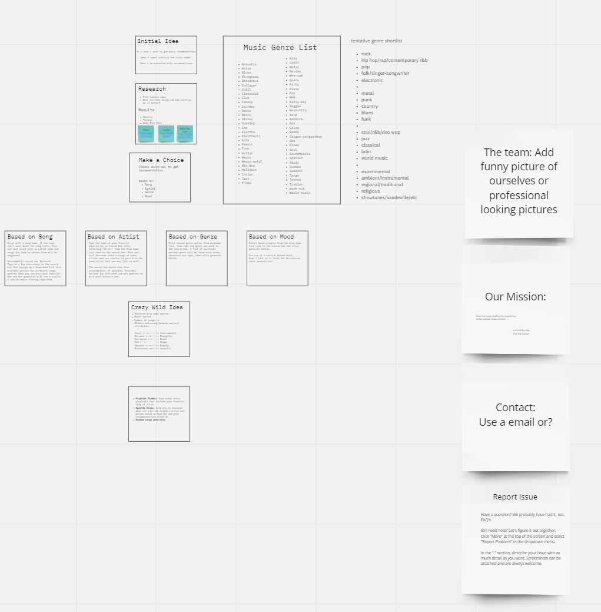

# Daja-limavi

## Progress (or the process) with screenshots

## Description

Provide a short description explaining the what, why, and how of your project. Use the following questions as a guide:

- What was your motivation?
- Why did you build this project? (Note: the answer is not "Because it was a homework assignment.")
- What problem does it solve?
- What did you learn?

## Table of Contents (Optional)

If your README is long, add a table of contents to make it easy for users to find what they need.

## How to use/features 

Provide instructions and examples for use. Include screenshots as needed.

To add a screenshot, create an `assets/images` folder in your repository and upload your screenshot to it. Then, using the relative file path, add it to your README using the following syntax:

## Collaborators

M Vincent Richards, Matt Montiel, Danny Cohen, Jacqueline Martinez, & Lindsey Isaac.

List your collaborators, if any, with links to their GitHub profiles.

If you used any third-party assets that require attribution, list the creators with links to their primary web presence in this section.

If you followed tutorials, include links to those here as well.

## Built With
This section should list any major frameworks/libraries used to bootstrap your project. Leave any add-ons/plugins for the acknowledgements section. 

## Updates for the future
As our class goes on and we learn more we want to come back and implement more of what we learn to improve this sites functionality. 
-
-
-
-In the end we would like for this project to become an application capable of playing music and not just sourcing them.

## License
MIT License

Copyright (c) 2023 MatthewMontiel